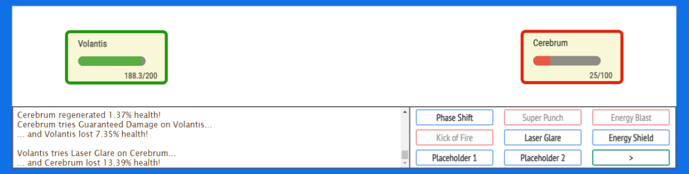

# supe-game
<!-- Display screenshot.png -->


Turn based fighting game loosely inspired by Pokémon battles

## Design Goals

First Release Goals:

* Runs in the browser
* Simple and intuitive interface
* More intricate effect types
* Player can fight a computer opponent (randomized moves)
* Player can fight a local opponent (same device)
* Game mode where you play 'one move per turn'

Second Release Goals:

* Game mode where each team member plays one move per turn
* Game mode where each player controls one team member (instead of controlling the whole team)
* Online multiplayer
* Simple AI opponents
* Customizable characters, moves and items

Third Release Goals:

* Tournament mode
* More complex AI opponents
* Customizable effects

### Effects

Active effects are effects that are applied to the user.
They are run every turn and can be positive or negative.

The effects can be applied to the character from a variety of sources.

* From items
  * (e.g. normal armor will increase physical and projectile damage absorbtion, decrease physical and projectile dodge chance and decrease the effectiveness of physical moves)
  * (e.g. a pair of magical boots increase your dodging and effectiveness for physical and projectile moves)

* From moves
  * (e.g. a character is hit with a poison dart, they take damage every turn until the poison disipates)
  * (e.g. a character takes a strength potion, the strength of their physical attacks are boosted until the potion's effects wear off)
  * (e.g. a character is shot with a bullet, they lose health each turn due to blood loss)

#### Effect Class Structure

* name: the name of the effect (string, required) e.g. "Punch Damage"
* type: the type of effect (string, required) e.g. "physical"
* target: the target of the effect (string, required) e.g. "target" (Can also be "self", this is used for effects that can backfire or harm the caster)
* required: whether the move stops if the effect is not applied (boolean, required) e.g. true (Used to chain effects, if false then the next effect will be run even if this effect fails)
* stat: the stat the effect affects (string) e.g. "health", "regen", "physical dodge", "physical strength", "regenVar", "poison effectivenessVar"
* duration: how many turns the effect lasts (int, required) e.g. 1
* strength: how much the effect will change the stat by on average (float, required) e.g. 0.1
* strengthVar: variance in the strength of the effect (float, required) e.g. 0.1
* effectiveness: the chance that the effect will be applied (float, required) e.g. 0.5
* effectivenessVar: variance in the effectiveness of the effect (float, required) e.g. 0.1

### Moves

Moves are the actions a character can take.
They can be positive, negative or they could be both.

Each move contains a set of effects the move applies.
These effects are normally applied to the target, but can also be applied to the caster.
Some effects may stop the move if they are not applied.

#### Move Class Structure

* name: the name of the move (string, required) e.g. "Punch"
* desc: the description of the move (string, required) e.g. "A basic punch attack"
* recharge: how many turns before the move can be used again (int, required) e.g. 1 (How many turns it takes for the move to recharge after being used)
* charge: used to show how far through the cooldown the move is (int, required) e.g. 0 (0 means the move is ready to be used)
* target: the types of targets the move can be used on (array, required) e.g. ["enemy", "ally", "self", "enemy team", "ally team", "all"]
* effects: an array of effects the move applies (array, required)
  * effect: an effect applied to the target (effect)
  * ...

### Item Class

Items can change the stats of the owner. (e.g. armor will increase physical and projectile damage absorbtion, decrease physical and projectile dodge chance and decrease the effectiveness of physical moves)
They may also come with a set of moves that the owner can use. (e.g. a sword can be used to attack an enemy)

#### Item Class Structure

* name: the name of the item (string, required) e.g. "Healing Potion"
* desc: the description of the item (string, required) e.g. "A potion that gives the user an additional 10% health"
* health: how much the item can impact before the item is used up or breaks (float, required) e.g. 0.1
* moves: the moves that the item has (array, required)
  * move: a move that the item has (move)
  * ...
* effects: the effects the item has on the wielder (array, required)
  * effect: an effect the item has (effect)
  * ...

### Character Class

Characters are the players and enemies in the game.
They each have their own stats, moves, items and active effects.
Players control their characters to fight against the opponent's characters.

### Character Class Structure

* name: the name of the character (string, required) e.g. "Data"
* desc: the description of the character (string, required) e.g. "An android created by Dr. Noonian Soong, crew member of the starship Enterprise"
* health: the current health points of the character (float, required) e.g. 1
* maxHealth: the maximum health points the character can have (float, required) e.g. 1
* healthRegen: the amount of health points the character regenerates per turn (float, required) e.g. 0.01
* stats: the dodging and absorbing stats of the character for each attack type (object, required)
  * physical: the dodging and absorbing stats for physical attacks (object, required)
    * dodge: chance to dodge an attack (float, required) e.g. 0.1
    * dodgeVar: variance in the chance to dodge an attack (float, required) e.g. 0.1
    * absorb: how much damage is absorbed by the character (float, required) e.g. 0.1
    * absorbVar: variance in the amount of damage absorbed by the character (float, required) e.g. 0.1
  * electric:
    * ...
  * fire:
    * ...
  * mental:
    * ...
  * poison:
    * ...
  * projectile:
    * ...
* moves: the moves the character can use (array, required)
  * move: the move the character can use (object, required)
  * ...
* items: the items the character has (array, required)
  * item: the item the character has (object, required)
  * ...
* effects: the active effects on the user (array, required)
  * effect: the effect the user has (object, required)
    * ...

* statChanges(type): Calculates changes to the character's stats based on the all active effects
  * type: what data to return (string, required) e.g. "sum" (returns their total stats), "changes" (returns the changes to the stats), "both" (returns both)

* effectChanges(type): Calculates changes to the character's effects based on the all active effects
  * type: what data to return (string, required) e.g. "sum" (returns their total effects), "changes" (returns the changes to the effects), "both" (returns both)

### Turn Logic

How a turn plays out:

* Each team member's current effects are applied to them
* The player selects a move and a target
* The move's effects are looped through
  * Calculate if the effect misses
  * Calculate if the effect is dodged
  * Calculate the effect's strength
  * Apply the effect to the target
  * If the effect is unsuccessful and later effects rely on it being successful, then further effects are skipped
* If the move has a cooldown, the charge is set to the recharge value
* The turn ends
* Depending on the game mode, the next team member's turn begins or the enemy team's turn begins

### Game Modes

* One Move Per Team (You can use one move per turn)
* One Move Per Character (Each character uses one move per turn)
* One Move Per Player (Each player controls one character and picks one move per turn)
* Basic Tournament ('One Move Per Team' games are played in rounds)
* Team Tournament ('One Move Per Character' games are played in rounds)
* Solo Tournament ('One Move Per Player' games are played in rounds)
* Ultimate Tournament (Teams and Individual players play against each other in rounds)

### Interface Design

The interface is designed to be as simple as possible.

The screen is divided into four main sections:

* The top section shows each team and their current stats.
* The screen is split in half horizontally by a menu tab. It is used to change which info/menus are shown below.
* The bottom left shows an information box that can be used to display character stats or the log. It shows the info for whatever you hover over or select (e.g. a character or a menu button).
* The bottom right shows the selection menu. It contains buttons which can be used to select a move, target, item and more.

The top section will contain an image of the character and their health bar.
Hovering over the image will cause the information box to show the character's stats (including gear, active effects, and moves)

The horizontal menu tab is used to change which info/menus are shown below.
It has buttons for 'Log' and 'Settings'.

The bottom left section will show the information box.
This is used to display the log, descriptions of buttons, and character stats.

The bottom right section will show the selection menu.
This is used to select a move, target, item and more.
The information box will show the description of the button when you hover over it.

e.g. Cerebrum vs Volantis

<!-- Markdown Javascript code block -->

```text
------------------------------------------------------------------------------------------------------------------------
|                                                                                                                      |
|    -----------------------                                                                                           |
|    | Volantis            |                                                                                           |
|    |  ------------       |                                                                                           |
|    | (            )      |                                                                                           |
|    |  ------------       |                                                                                           |
|    |             200/200 |                                                                                           |
|    -----------------------                                                                                           |
|                                                                                                                      |
|                                                                                           -----------------------    |
|                                                                                           | Cerebrum            |    |
|                                                                                           |  ------------       |    |
|                                                                                           | (            )      |    |
|                                                                                           |  ------------       |    |
|                                                                                           |             100/100 |    |
|                                                                                           -----------------------    |
|                                                                                                                      |
------------------------------------------------------------------------------------------------------------------------
| Log | Info | Settings |                                                       | Characters | Actions | Moves | Items |
------------------------------------------------------------------------------------------------------------------------
| Cerebrum uses punch on Volantis                                               |                                      |
| ... but misses!                                                               |  ----------------  ----------------  |
|                                                                               |  |     Punch    |  |     Kick     |  |
|                                                                               |  ----------------  ----------------  |
|                                                                               |                                      |
|                                                                               |  ----------------  ----------------  |
|                                                                               |  | Brain Freeze |  | Mind Control |  |
|                                                                               |  ----------------  ----------------  |
|                                                                               |                                      |
|                                                                               |  ----------------  ----------------  |
|                                                                               |  |  Think Fast  |  |  Neuroblast  |  |
|                                                                               |  ----------------  ----------------  |
|                                                                               |                                      |
|                                                                               |  ----------------  ----------------  |
|                                                                               |  |      <-      |  |      ->      |  |
|                                                                               |  ----------------  ----------------  |
|                                                                               |                                      |
------------------------------------------------------------------------------------------------------------------------
```
