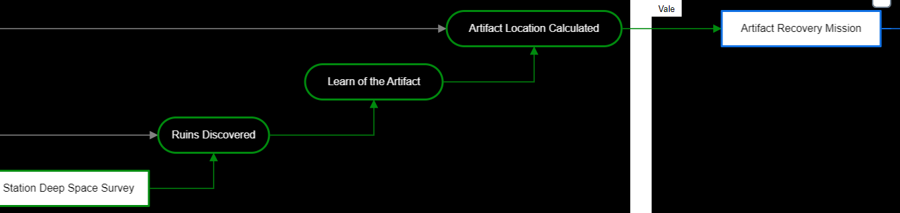

# supedb
<!-- Display screenshot.png -->

A database to help with complex story planning

## Design

The application will have 3 main parts as follows:
map: Shows relationships between events in time
wiki: Shows information about characters, locations, and other things
versions: Allows for multiple versions of the story to be created and compared

### Node map

The node map will be a visual representation of the storylines and events.
Each node can be connected to other nodes to show the relationships between them.

The relationships can be one of the following:

* Cause (one event directly causes another, shown by a colored arrow from the cause to the effect)
* Factor (one event is a factor in causing another, shown by a grey arrow from the factor to the effect)
* Extension (two events either happen simultaneously or one node is an extension of the other, shown by a colored line between the nodes)

There are also 4 main types of nodes:

* Head Node (used to label a group of nodes, e.g. a character or storyline)
* Sub Node (an individual event associated with a head node, e.g. a character finds a MacGuffin)
* Era Divider (used to divide the story into eras, e.g. modern day, old west, etc.)
* Info Node (used for additional information that would be too bulky to include in the node map, e.g. a ship's crew manifest or a physical description of a character)

Head nodes each have their own color, which is used to color the arrows and lines connecting to them.
It allows a quick distinction between the different groups of nodes and their relationships.

#### Node menu

Each node has it's own menu that allows the user to perform the following actions:
* Delete the node
* Edit node links (coming soon)
* Change or add the node's head (not for head nodes, coming soon)
* Change node color (head nodes only)

### Wiki 

(coming soon)

The wiki will contain pages for each head node.
Each page will contain the information in it's info nodes, and the page sections will be the information from it's associated sub nodes.
Changes to this wiki will change the information in the info nodes and sub nodes.

### Version control

(coming soon)

Users will be able to save their work in different ways to allow for iteration and group collaboration.
Here are the different types of saves/versions:

* Draft (an idea of changes to the story, only the user can see and edit the draft)
* Suggestion (an idea of changes to the story, everyone can see and edit the suggestion)
* Proposal (a set of conflicting suggestions, users can vote to decide which suggestion to use)
* Change (a change that skips the suggestion and proposal stages, if a user appeals the change, it will become a proposal)

Users will see a line representing the current version of the story.
There will be branches off of this line representing the different versions of the story.
Drafts will be shown as grey lines with a dot at the end. (the dot links to the draft)
Suggestions will be shown as colored lines with a dot at either end. (the first dot links to the proposal, the second dot links to the suggestion draft)
Proposals will be shown as a dot (the dot described above) which links to the proposal.
Changes will be shown as colored lines with a dot at either end. (the first dot links to the proposal, the second dot links to the change)

Drafts will be shown as lines curving to the right, while changes will be shown as lines curving to the left.

## UI Design

The UI will be retrofuturistic, based on the style of the TVA from the Marvel Cinematic Universe.
And since I love the retrofuturistic UI from Dead Space so much, I'll likely use elements from that as well.

### Colors

Shades of orange will be used for the main UI elements.
Shades of black/dark grey will be used for the background.
White will be used for most text.

Other colors that will be present, but used less frequently, are:

* Yellow (accent color)
* Red (for importance and as an accent color)
* Green (for success and as an accent color)

### Text, icons, borders, and buttons

Title text will be pixelated, like old terminals.
While most other text will be a clean, modern font.
Each element will have a fluorescent glow around it. (including some text)
Icons, borders, and buttons will be rounded to offset the sharp edges of the text.

### Inspiration images

<!-- Image grid (2x3) TVA on left and DS on right -->

|  |  |
|--|--|
|  |  |
|  |  |
|  |  |
|  |  |
|  |  |

### Color palette

<!-- Showing a table displaying each color -->
<!-- Orange, black, white, yellow, red, green -->

| Color | Hex | Purpose |
| ----- | --- | ------- |
| 
Orange
 | #CC4E00 | Main UI elements |
| 
Black
 | #000000 | Background |
| 
White
 | #ffffff | Text |
| 
Yellow
 | #FCCE14 | Accent color |
| 
Red
 | #E81313 | Importance and accent color |
| 
Green
 | #004507 | Success and accent color |

## Miss Minutes (site mascot and notification system)

Miss Minutes is a character from the Marvel Cinematic Universe.
She is an A.I. in the TVA that is responsible for keeping track of timelines.
She has a southern dialect and is very friendly.
She is also very helpful and will help users navigate the site.

Here are some events/conditions and what Miss Minutes will say:
(Note that the responses will be randomized)

| Event/Condition | Response (classic) | Response (miss minutes) |
| --------------- | ------------------ | ----------------------- |
| New suggestion  | {user} created a suggestion {suggestion} | {user} has found a branch in the timeline. |
| Delete suggestion | {user} deleted a suggestion {suggestion} | {user} has pruned a branch in the timeline. |
| Proposal vote opening | {user} opened a vote for a proposal {proposal} | {user} proposes to change the sacred timeline. |
| Proposal accepted | {user} accepted a proposal {proposal} | The sacred timeline has been diverted. |
| Proposal rejected | {user} rejected a proposal {proposal} | The proposal has been rejected. |
| Change made | {user} made a change {change} | {user} has altered the sacred timeline. |
| Change appeal opened | {user} opened an appeal for a change {change} | {user} opens review of a change to the sacred timeline. |
| Change appeal accepted | {user} accepted an appeal for a change {change} | The change to the sacred timeline has been reverted. |
| Change appeal rejected | {user} rejected an appeal for a change {change} | The appeal has been rejected. |
| User added to project | {user} was added to a project {project} | {user} has been added to a project as a {role}. |

Here is a list of terminology used by the TVA, their definitions, and what the definitions mean in the context of the site:

* Miss Minutes (the TVA's mascot and computer system) - the site mascot and notification system
* The Sacred Timeline (the timeline that the TVA is trying to protect) - current canon
* Reset Charges / Pruning (destroys the timeline) - delete a version/suggestion
* Branches (the different timelines) - versions/suggestions
* Monitored Branches (the branches that the TVA is watching) - versions/suggestions that are currently being worked on (i.e. drafts/suggestions that are not yet canon)
* Diversion Review (the process of reviewing a plan to divert the sacred timeline) - A proposal up for voting
* Time Variance Authority (monitors timelines in the multiverse) - the site
* Alioth (trans-temporal creature used to guard the Void) - used to ban people from the site
* Nexus of all realities (the space between realities) - used to view all universes
* The Void (the place where all timelines go when they are destroyed) - used to house deleted versions/suggestions before they are permanently deleted (by Alioth)
* Citadel at the End of Time (where He Who Remains resides) - admin panel
* He Who Remains (the ruler of the TVA) - the site admin
* TVA Office (headquarters for the TVA) - main page
* Minuteman (a solider for the TVA) - read
* Hunter (commands a team of Minutemen) - read and suggest
* Consultant (civilian expert on a specific subject) - read, suggest, and vote
* Analyst (expert timeline analyst) - read, suggest, vote, and edit
* Agent (command over inner workings) - read, suggest, vote, edit, and admin
* Judge (runs the TVA) - read, suggest, vote, edit, admin, and project owner
  (Note: project owners don't have any special permissions except that they cannot be removed from a project unless they transfer ownership to someone else)